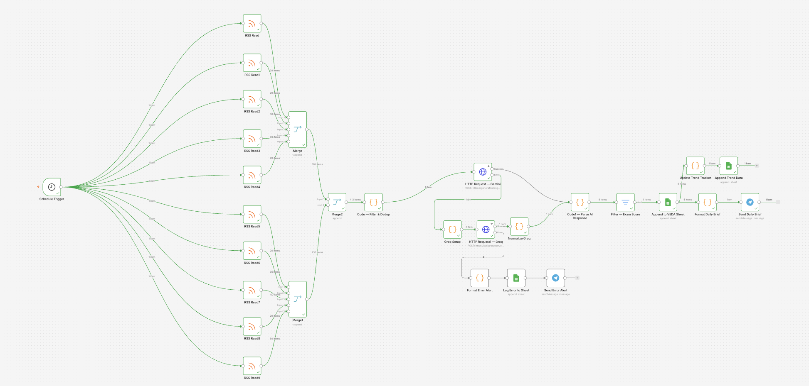
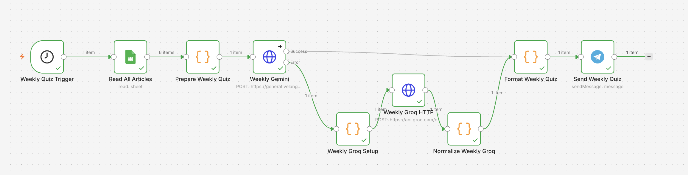
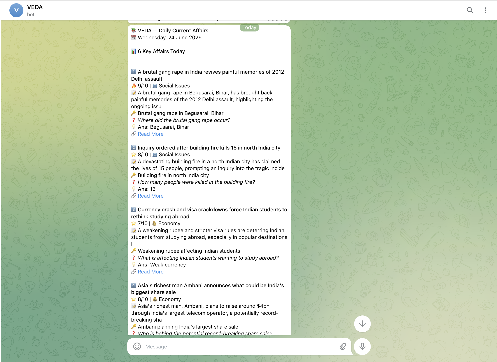
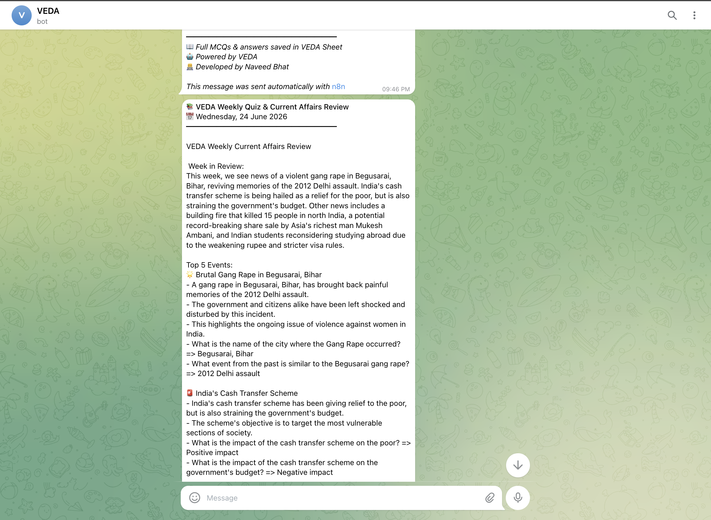
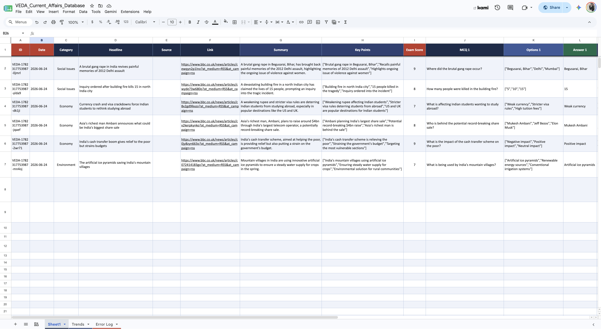

<div align="center">

# VEDA
### Verified & Enriched Daily Affairs Automation

*An autonomous AI system that curates, scores, and delivers daily current affairs for competitive exam preparation — every morning.*


<br/>


</div>

---

## Overview

VEDA is a fully automated n8n workflow that aggregates current affairs from 10 major Indian news RSS feeds, analyzes every article using large language models for exam relevance, generates practice MCQs, and delivers a structured daily brief — every morning without any manual effort.

It is built specifically for competitive exam aspirants (UPSC, SSC, Banking, State PCS) who need to stay on top of current affairs but lack the time to manually curate news from multiple sources every day.

> **Built for zero-miss coverage** — VEDA includes a dual-AI fallback system (Gemini → Groq) ensuring the daily brief is always delivered. A weekly quiz automatically generated from the week's top stories reinforces retention. Every article that scores below 7/10 is silently filtered out — only what truly matters reaches you.

---







---

## How It Works

VEDA runs on two separate schedules:

### Daily Morning Brief (7 AM IST, every day)

```
10 RSS Feeds → Merge → AI Filter + Dedup → LLM Analysis → Exam Score Gate → Sheet + Telegram
```

### Weekly Quiz (Every Sunday)

```
Read Google Sheet → Filter Last 7 Days → AI Quiz Generation → Format → Send to Telegram
```

| Stage | What Happens |
|-------|-------------|
| **Aggregation** | Pulls articles from 10 Indian news RSS feeds in parallel |
| **Filtering** | Exam-keyword filter keeps only current-affairs-relevant articles |
| **Deduplication** | Cross-run memory skips articles already seen in previous runs |
| **LLM Analysis** | Batch call to Gemini Flash (or Groq fallback) for full analysis |
| **Exam Score Gate** | Only articles scoring ≥ 7/10 for exam relevance are saved |
| **MCQ Generation** | 2 practice MCQs auto-generated per article |
| **Storage** | Full structured record saved to Google Sheets database |
| **Trend Tracking** | Category and score statistics logged each run |
| **Telegram Brief** | Formatted daily brief sent to Telegram every morning |
| **Weekly Quiz** | Sunday: AI-generated quiz from the week's top articles |

---

## Key Features

- **Automated Daily Brief** — Runs at 7 AM IST every day with zero manual intervention
- **AI-Powered Relevance Scoring** — Each article rated 1–10 for competitive exam relevance
- **10 Indian News Sources** — The Hindu, India Today, Livemint, NDTV, and more
- **Auto MCQ Generation** — 2 practice questions generated per article for self-testing
- **Dual-AI Redundancy** — Automatic failover from Gemini Flash to Groq Llama 3.1 on failure
- **Cross-Run Deduplication** — Never delivers the same article twice across runs
- **Weekly Quiz** — Every Sunday, a Telegram quiz from the week's top-scored stories
- **Trend Tracking** — Category distribution and top stories tracked weekly
- **Error Alerting** — Instant Telegram alert if both AI systems fail, with full error log
- **Structured Database** — Full article metadata, MCQs, and scores in Google Sheets

---

## Architecture

<div align="center">

```
                    ┌──────────────────────────────┐
                    │   Schedule Trigger (7AM IST)  │
                    └─────────────┬────────────────┘
                                  │
                    ┌─────────────▼────────────────┐
                    │   10 RSS Feeds (parallel)     │
                    │   The Hindu · India Today     │
                    │   Livemint · NDTV · PIB · ... │
                    └─────────────┬────────────────┘
                                  │
                    ┌─────────────▼────────────────┐
                    │  Exam Keyword Filter + Dedup  │
                    │  → top 15 unseen articles     │
                    └─────────────┬────────────────┘
                                  │
               ┌──────────────────▼──────────────────┐
               │        Primary AI — Gemini Flash     │
               └──────┬──────────────────────┬───────┘
                      │ ✅ Success            │ ❌ Error
                      │                       ▼
                      │         ┌─────────────────────────┐
                      │         │  Fallback AI — Groq      │
                      │         │  Llama 3.1 8B Instant    │
                      │         └──────┬──────────┬───────┘
                      │                │ ✅        │ ❌
                      │                │          ▼
                      │                │  🚨 Format Error Alert
                      │                │  📋 Log Error to Sheet
                      │                │  📱 Send Error Alert (Telegram)
               ┌──────▼────────────────▼──────┐
               │   Parse + Exam Score Gate ≥ 7 │
               └──────────────┬───────────────┘
                              │
              ┌───────────────┴──────────────────┐
              ▼                                   ▼
  ┌─────────────────────┐            ┌──────────────────────┐
  │  Append to VEDA      │            │  Update Trend Tracker │
  │  Google Sheet        │            │  → Append Trends tab  │
  └────────────┬────────┘            └──────────────────────┘
               │
  ┌────────────▼────────┐
  │  Format Daily Brief  │
  │  → Send via Telegram │
  └─────────────────────┘

  ─────────────────────────────────────────────────────
  WEEKLY (Sunday):
  Read Sheet → Filter 7 days → Gemini/Groq Quiz Gen
  → Format Weekly Quiz → Send to Telegram
```

</div>

---

## Categories Covered

| Category | Examples |
|----------|---------|
| `Polity` | Bills, Acts, Supreme Court, Parliament, Constitutional amendments |
| `Economy` | RBI, GDP, Budget, Inflation, Banking, Trade policy |
| `Science & Tech` | ISRO missions, Tech launches, Scientific discoveries |
| `Environment` | Climate policy, Wildlife, Disaster management |
| `International Relations` | Treaties, Summits, G20, BRICS, SCO, UN |
| `Sports` | Olympics, Asian Games, National championships |
| `Awards & Honours` | Padma Awards, Nobel, Bharat Ratna, Literary prizes |
| `Defense & Security` | Military exercises, Defense deals, Border situations |
| `Social Issues` | Public health, Education, Women safety, Welfare |
| `Appointments` | Ministers, Governors, CEOs, Ambassadors |

---

## Data Schema

### Main Sheet — Article Database

| Field | Description |
|-------|-------------|
| `ID` | Unique VEDA article identifier |
| `Date` | Processing date |
| `Category` | Exam category (10 options) |
| `Headline` | Article headline (max 120 chars) |
| `Source` | News source name |
| `Link` | Original article URL |
| `Summary` | AI-generated 2-sentence factual summary |
| `Key Points` | 3 key facts separated by pipe `\|` |
| `Exam Score` | 1–10 relevance rating (only ≥ 7 saved) |
| `MCQ 1` | Practice MCQ question 1 |
| `Options 1` | A) B) C) D) answer choices |
| `Answer 1` | Correct answer with explanation |
| `MCQ 2` | Practice MCQ question 2 |
| `Options 2` | A) B) C) D) answer choices |
| `Answer 2` | Correct answer with explanation |

### Trends Tab — Weekly Statistics

| Field | Description |
|-------|-------------|
| `Week` | ISO week identifier (e.g., `2026-W26`) |
| `Total Articles` | Total articles saved this run |
| `Avg Exam Score` | Average exam relevance score |
| `Top Category` | Most frequent category this week |

### Error Log Tab — Failure Records

| Field | Description |
|-------|-------------|
| `Timestamp` | When the failure occurred (IST) |
| `Node Name` | Which n8n node failed |
| `Error Message` | Description of the error |
| `Status` | Always `Failed` (for filtering) |

---

## Tech Stack

| Tool | Role | Free Tier |
|------|------|-----------|
| [n8n Cloud](https://n8n.io) | Workflow automation — 38-node pipeline | 1,000 executions/month |
| [Google Gemini Flash](https://aistudio.google.com) | Primary LLM — article analysis + quiz generation | 1,500 req/day |
| [Groq — Llama 3.1 8B](https://console.groq.com) | Fallback LLM — auto-activates on Gemini failure | 14,400 req/day |
| [Google Sheets](https://sheets.google.com) | Structured article + trend database | Unlimited |
| [Telegram Bot API](https://core.telegram.org/bots) | Daily brief + weekly quiz delivery | Unlimited |

**Total running cost: $0/month**

---

## Reliability

| Scenario | Outcome |
|----------|---------|
| Gemini available | ✅ Full brief delivered via Gemini |
| Gemini rate limited / down | ✅ Full brief delivered via Groq (auto-fallback) |
| Both AIs unavailable | 🚨 Instant Telegram alert + Error Log row saved |
| Article already seen | ✅ Silently skipped by cross-run deduplication |
| Article scores < 7/10 | ✅ Filtered out — not saved, not sent |
| Sunday trigger fires | 📝 Weekly quiz delivered via Telegram |

---

## News Sources Monitored

| Source | Category Focus |
|--------|---------------|
| The Hindu | National, Politics, Economy, International |
| The Hindu Business | Economy, Markets, Finance |
| India Today | General, Politics, National |
| Livemint | Economy, Finance, Business |
| NDTV | National, General |
| Press Information Bureau (PIB) | Government schemes, Policy |
| Times of India | National, General |
| Indian Express | Politics, Social Issues |
| Hindustan Times | National, General |
| Down to Earth | Environment, Science |

---

## Prerequisites

To run your own instance of VEDA, you will need:

- An [n8n Cloud](https://app.n8n.cloud) account or self-hosted n8n instance
- A [Google Gemini API key](https://aistudio.google.com/app/apikey) (free tier)
- A [Groq API key](https://console.groq.com) (free tier)
- A Telegram Bot token (via [@BotFather](https://t.me/BotFather))
- A Google Sheets spreadsheet with header row on **Row 2**

---

## Configuration

All secrets are managed via n8n's built-in credential system — never hardcoded.

| Secret | Where Used |
|--------|-----------|
| `Gemini API Key` | HTTP Request URL (`?key=...`) |
| `Groq API Key` | HTTP Request Authorization header |
| `Telegram Bot Token` | n8n Telegram credential |
| `Google Sheets OAuth2` | n8n Google Sheets credential |

> ⚠️ **Security Note:** Never expose API keys in public repositories. Use n8n's built-in credential system to store all secrets securely.

---

## Setup

1. Import `VEDA.json` into your n8n instance
2. Create credentials in n8n for: Gemini, Groq, Google Sheets OAuth2, Telegram Bot
3. Create a Google Sheet with tabs: `Sheet1` (main), `Trends`, `Error Log` — set **header row to Row 2**
4. Update the Telegram Chat ID in all Telegram nodes to your own
5. Activate workflow — it runs daily at 7 AM IST automatically

---

## License

This project is licensed under the [MIT License](LICENSE).

---

## Author

**Naveed Bhat**

> *"The best exam preparation is not reading more — it's reading what matters."*

---

<div align="center">

*VEDA — Built June 2026 | 38-node n8n workflow | 10 Indian news sources | Dual-AI redundancy*

</div>
